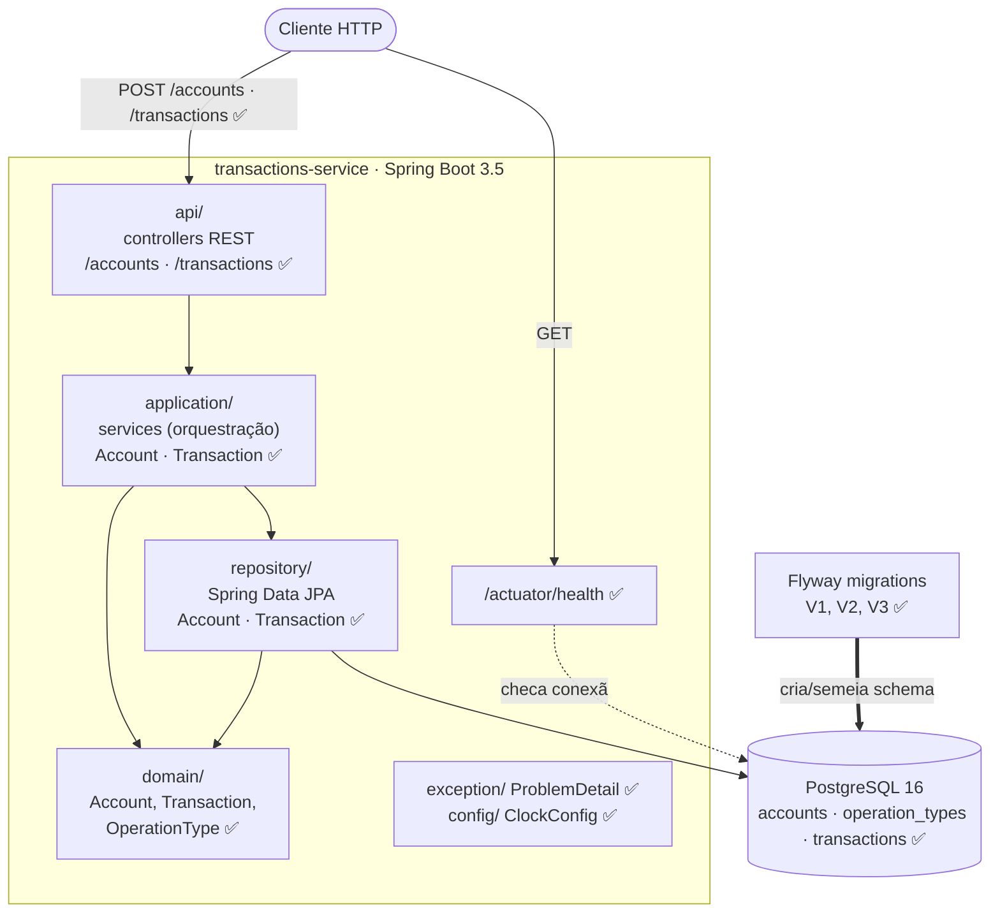

# transactions-service

[](https://github.com/DanMke/transactions-service/actions/workflows/ci.yml)

Serviço de transações (contas e lançamentos financeiros), construído em fases.
Cada tipo de operação (compra à vista, compra parcelada, saque, voucher de
crédito) normaliza o sinal do valor: compras e saque são negativos, voucher é
positivo.

> **Estado atual:** contas (`POST /accounts`, `GET /accounts/{id}`) e
> transações (`POST /transactions`) implementadas, com tratamento de erro
> unificado via `ProblemDetail` e documentação OpenAPI/Swagger. Veja o
> desenho abaixo.

---

## Arquitetura (visão macro)

O diagrama reflete o **alvo** da aplicação; os itens marcados com ✅ já existem,
os marcados com _(planejado)_ chegam em fases futuras. Será atualizado ao longo
do projeto.



**Camadas** (pacote raiz `io.github.danmke.transactions`):

| Pacote | Responsabilidade |
|---|---|
| `api/` | Controllers REST / DTOs — `AccountController`, `TransactionController` + DTOs de request/response ✅ |
| `application/` | Services que orquestram o fluxo (buscam no repository, coordenam entidades, lançam exceptions de negócio) — `AccountService`, `TransactionService` ✅ |
| `domain/` | Entidades e regra de negócio pura (sem depender de HTTP/controllers/DTOs) ✅ |
| `repository/` | Acesso a dados (Spring Data JPA) — `AccountRepository`, `TransactionRepository` ✅ |
| `exception/` | Exceptions e tratamento de erro — exceptions de negócio + `GlobalExceptionHandler` (`ProblemDetail`) ✅ |
| `config/` | Configurações da aplicação — `ClockConfig` (bean `Clock`) ✅ |

---

## Requisitos para executar

O que a máquina precisa depende de **como** você quer rodar:

| Cenário | Requisitos |
|---|---|
| **Rodar a aplicação inteira** (`make up`) | Docker + Docker Compose + Make + Git |
| **Desenvolver / rodar testes** (`make test`, `make run`) | O acima **+ JDK 21** |

- **Docker Desktop precisa estar em execução** para os testes (Testcontainers) e para o `docker compose`.
- **Gradle não precisa ser instalado** — o *wrapper* (`gradlew` / `gradlew.bat`) baixa a versão correta automaticamente.
- No **Windows**, `make` não vem por padrão: instale com `choco install make` (Chocolatey) ou `scoop install make`.

---

## Versões utilizadas no desenvolvimento

| Ferramenta / Biblioteca | Versão |
|---|---|
| Java (JDK) | 21 LTS |
| Spring Boot | 3.5.16 |
| Gradle | 8.14.5 (via wrapper) |
| Plugin `io.spring.dependency-management` | 1.1.7 |
| PostgreSQL | 16.14 (imagem `postgres:16.14-alpine`) |
| Driver JDBC PostgreSQL | Gerenciado pelo Spring Boot 3.5.16 |
| Flyway | Gerenciado pelo Spring Boot 3.5.16 (`flyway-core` + `flyway-database-postgresql`) |
| Hibernate ORM | Gerenciado pelo Spring Boot 3.5.16 |
| JUnit Jupiter | Gerenciado pelo Spring Boot 3.5.16 |
| Testcontainers | Gerenciado pelo Spring Boot 3.5.16 |
| Docker Engine | 20.10+ (API mínima 1.40) |

---

## Como executar

Todos os comandos partem da raiz do projeto. A forma recomendada é via `make`
(rode `make help` para ver todos os alvos).

### Aplicação completa em Docker (não precisa de JDK)

```bash
./run.sh         # build + sobe app e Postgres (docker compose up --build)
make up          # equivalente, via make
make up-d        # o mesmo, em segundo plano
make down        # derruba tudo
```

A app fica disponível em `http://localhost:8080`. Verifique a saúde:

```bash
curl http://localhost:8080/actuator/health   # -> {"status":"UP", ...}
```

Documentação interativa da API (Swagger UI) e o contrato OpenAPI:

```
http://localhost:8080/swagger-ui.html   # Swagger UI
http://localhost:8080/v3/api-docs        # OpenAPI JSON
```

### Desenvolvimento local (precisa de JDK 21)

```bash
make run         # sobe só o Postgres e roda a app com bootRun
make db-up       # sobe só o Postgres
make db-down     # para o Postgres
```

### Testes

```bash
make test        # suíte completa (unit + integração; precisa de Docker)
make test-unit   # só os testes unitários rápidos (sem Docker)
make retest      # re-roda tudo ignorando o cache "up-to-date" do Gradle
```

Relatório HTML dos testes: `build/reports/tests/test/index.html`.

### Sem `make` (Gradle/Compose direto)

```bash
./gradlew bootRun          # (Windows: .\gradlew.bat bootRun)
./gradlew test
docker compose up --build
```

---

## Estrutura do projeto

```
src/main/java/io/github/danmke/transactions/
  api/            # controllers REST + DTOs      ✅
    dto/
  application/    # services de orquestração     ✅
  domain/         # entidades + regra de negócio ✅
  repository/     # acesso a dados              ✅
  exception/      # tratamento de erros         ✅
  config/         # configurações               ✅
src/main/resources/
  application.yml
  db/migration/   # V1__create_accounts, V2__create_operation_types, V3__create_transactions
src/test/java/    # testes unitários e de integração
Dockerfile        # build multi-stage
docker-compose.yml
Makefile          # atalhos de build/execução/testes
```

---

## Design decisions

Registro incremental das decisões de projeto relevantes, organizado por fase.
Atualizado à medida que cada fase introduz uma decisão.

### Fase 1 — Walking skeleton

- **Gradle wrapper (sem Gradle global):** o `gradlew`/`gradlew.bat` fixa e baixa
  a versão exata do Gradle; ninguém precisa instalar Gradle na máquina.
- **Health check via Actuator primeiro:** prova de vida ponta a ponta (app sobe,
  conecta no banco, responde) antes de qualquer regra de negócio.
- **Detalhes do health check seguros por padrão:** `show-details` fica como
  `never` por default e pode ser sobrescrito via variável de ambiente quando
  necessário em ambientes controlados.
- **Docker multi-stage, build sem testes:** o estágio de build roda `bootJar`
  (não `build`), evitando exigir Docker-in-Docker; os testes de integração com
  Testcontainers rodam localmente / na pipeline, onde há um Docker acessível.
- **Testcontainers para integração:** os testes sobem um PostgreSQL **real**
  (mesma engine de produção) em vez de um banco em memória (H2), evitando
  divergências de comportamento.

### Fase 2 — Domínio e migrations

- **JPA introduzido só nesta fase:** a Fase 1 usava apenas o datasource; a
  dependência de JPA entra na fase que de fato a usa (não antecipar).
- **Chaves primárias `BIGINT` identity:** geradas pelo banco
  (`GENERATED ALWAYS AS IDENTITY`) — simples e sequenciais; a aplicação nunca
  define o id.
- **`OperationType` como enum de código + `AttributeConverter`:** não é entidade
  JPA e não tem repository; a tabela `operation_types` existe **só para a FK**.
  Um converter mapeia `enum ↔ operation_type_id`, preservando integridade
  referencial sem transformar o tipo num agregado consultável.
- **Dinheiro como `NUMERIC(19,2)` → `BigDecimal`; data como `TIMESTAMPTZ` →
  `OffsetDateTime`:** evita erros de ponto flutuante em valores monetários e
  ambiguidade de fuso horário.
- **Flyway como fonte única da verdade + `ddl-auto: validate`:** as migrations
  versionadas criam e semeiam o schema; o Hibernate apenas **valida** as
  entidades contra ele na subida, nunca altera o schema.
- **Invariantes garantidas nos construtores do domínio:** a normalização do
  sinal (`operationType.normalize(amount)`) e as validações defensivas
  (`amount` não nulo/zero; `document_number` não vazio, com `trim()`) acontecem
  **dentro** dos construtores de `Transaction` e `Account`. Assim é impossível
  instanciar uma entidade em estado inválido, independentemente de quem a cria.
  A validação "de negócio" que gera resposta HTTP fica para o service (Fase 5).
- **`CHECK` constraints no banco (`amount <> 0`,
  `btrim(document_number) <> ''`):** defesa em profundidade, além da validação
  no domínio.
- **`document_number` sem `UNIQUE`:** decisão explícita de não impor unicidade
  nesta fase.

### Fase 3 — POST /accounts

- **JSON em snake_case global** (`spring.jackson.property-naming-strategy:
  SNAKE_CASE`): o desafio especifica campos como `document_number` /
  `account_id`; configurar globalmente evita `@JsonProperty` espalhado pelos
  DTOs.
- **Validação no DTO espelha a coluna do banco** (`@Size(max = 50)` casa com
  `VARCHAR(50)`): sem isso, um documento acima do limite viraria erro **500** do
  banco em vez de **400** da aplicação. `@NotBlank` cobre ausência/branco.
- **DTOs dedicados em `api/dto/`** (`CreateAccountRequest`, `AccountResponse`),
  como `record`s: a entidade JPA nunca é serializada direto na resposta; o
  controller faz o mapeamento, mantendo `domain` livre de HTTP.
- **`AccountService` recebe primitivos, não DTOs:** os DTOs ficam confinados em
  `api/`; a camada `application` orquestra sobre o domínio.
- **`201 Created` + header `Location`** apontando para `/accounts/{id}` (o `GET`
  correspondente entra numa fase futura; aqui só emitimos o header).
- **Erros de validação usam o `400` padrão do Spring:** um handler de erro
  formatado é escopo de fase futura (`exception/`).

### Fase 4 — GET /accounts/{id} e tratamento de erro

- **`ProblemDetail` (RFC 7807) como formato único de erro:** um
  `@RestControllerAdvice` (`GlobalExceptionHandler`) que estende
  `ResponseEntityExceptionHandler` centraliza as respostas de erro. Tanto o
  erro de negócio (**404**) quanto os de Bean Validation (**400**) saem no
  mesmo formato — a API nunca expõe dois formatos de erro diferentes.
- **`title` e `type` explícitos nos problemas:** cada erro recebe um título
  estável e um `type` no formato `urn:problem-type:*`, facilitando testes,
  documentação e interpretação por clientes.
- **`handleMethodArgumentNotValid` sobrescrito:** converte os erros de campo do
  Bean Validation num `ProblemDetail`, com uma extensão `errors` (lista de
  `{ field, message }`) para o cliente saber exatamente o que falhou.
- **Erros comuns de infraestrutura HTTP também padronizados:** JSON malformado
  (`handleHttpMessageNotReadable`) e path/query parameter com tipo inválido
  (`handleTypeMismatch`, como `GET /accounts/abc`) também retornam
  `ProblemDetail` com **400**.
- **Exceptions de negócio em `exception/`, lançadas pelo service:**
  `AccountService.getById` lança `AccountNotFoundException` quando a conta não
  existe; o handler a mapeia para 404. A decisão "existe ou estoura" fica na
  camada `application`, não no controller.
- **`getById` semântico:** retorna o domínio ou lança — em vez de devolver
  `Optional`/`null` e empurrar a decisão de status para o controller.

### Fase 5 — POST /transactions

- **Precedência explícita de validação/erro** (do payload ao negócio): campos
  ausentes e `amount` fora de `@Digits(integer = 17, fraction = 2)` → **400**
  (Bean Validation); `amount` negativo → **400**; conta inexistente → **404**;
  `operation_type_id` desconhecido → **422**; `amount` zero → **422**. O
  `TransactionService` implementa exatamente essa ordem.
- **Sinal negativo é erro de contrato (400), não de negócio:** a API só aceita
  magnitude positiva — o sinal é derivado do tipo de operação. Zero, por outro
  lado, é regra de negócio → **422**.
- **`IllegalArgumentException` de `fromId()` convertida explicitamente** em
  `InvalidOperationTypeException` dentro do service. Não se mapeia
  `IllegalArgumentException` genericamente no handler, senão as validações
  defensivas de domínio (Fase 2) seriam capturadas e classificadas como 422
  por engano.
- **`Clock` injetável (`ClockConfig`):** o `event_date` vem de
  `OffsetDateTime.now(clock)` — `Clock.systemUTC()` em produção, `Clock.fixed`
  nos testes, tornando o carimbo de tempo determinístico e testável.
- **Resposta com o estado final, não eco do input:** `TransactionResponse`
  devolve o `amount` já **normalizado** (sinal aplicado pela entidade) e o
  `event_date` gerado — o cliente vê o que foi de fato persistido.
- **`201 Created` + `Location` em transactions:** mesmo sem um `GET
  /transactions/{id}` no escopo do PDF, o endpoint retorna o identificador do
  recurso criado em `Location` por consistência com `POST /accounts` e com o
  estilo REST.
- **A normalização permanece no domínio:** o service valida e delega; quem
  aplica o sinal é o construtor de `Transaction` (Fase 2), não o service.

### Fase 6 — Documentação de API

- **springdoc-openapi (Swagger UI) com versão pinada** (`2.8.9`): a dependência
  entra só nesta fase e não é gerenciada pelo BOM do Spring Boot, então a
  versão é fixada explicitamente. Swagger UI em `/swagger-ui.html`, contrato em
  `/v3/api-docs`.
- **Status de erro documentados por anotação:** o springdoc infere 200/201 e os
  DTOs, mas não os 400/404/422 (que vêm do `GlobalExceptionHandler`). Por isso
  os controllers declaram `@ApiResponses` com `ProblemDetail` como schema de
  erro, e os DTOs trazem `@Schema(example = ...)`.
- **`OpenApiConfig` apenas com metadados reais** (título, versão, descrição) —
  não uma classe vazia só para preencher a estrutura de pastas.
- **Actuator preservado:** o springdoc não documenta o Actuator por padrão;
  `/actuator/health` continua acessível (coberto por teste).

### Fase 7 — CI

- **GitHub Actions com um único job (`build-and-test`)** a cada push e pull
  request: `./gradlew build` compila, testa (inclusive os de Testcontainers) e
  monta o jar. Sem deploy nem outros jobs.
- **Testcontainers no runner sem serviços extras:** o `ubuntu-latest` já tem
  Docker em execução, então os testes de integração sobem seus próprios
  containers — não é preciso declarar `services:` no workflow.
- **Versões consistentes com o projeto:** JDK 21 via `setup-java`; o Gradle
  8.14.5 vem do wrapper, então a CI usa exatamente a mesma versão do
  desenvolvimento.

### Fase 8 — run.sh e containerização

- **`run.sh` como ponto de entrada único:** `docker compose up --build` (CLI
  v2, com espaço) — sobe app + Postgres com um comando, sem exigir JDK/Gradle
  local.
- **Bit executável preservado no Git** via `git update-index --chmod=+x run.sh`
  (mode `100755`), já que o repositório tem origem Windows, onde o bit não é
  capturado do filesystem.
- **`.gitattributes` força LF em scripts de shell** (`*.sh`, `gradlew`): sem
  isso, o `core.autocrlf` no Windows converteria o `run.sh` para CRLF no
  checkout e o interpretador falharia no Linux/CI/Docker. Batch files (`*.bat`)
  permanecem CRLF.
- **Containerização revisada:** Postgres com healthcheck (`pg_isready`) e app
  com `depends_on: condition: service_healthy` — a app só inicia após o banco
  estar pronto. Validado subindo o stack e confirmando `/actuator/health` = UP.
