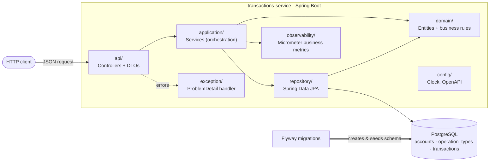
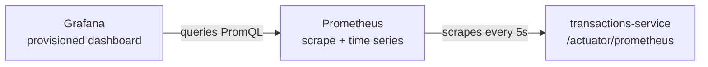

# Transactions Service

[](https://github.com/DanMke/transactions-service/actions/workflows/ci.yml)

A REST service for managing **accounts** and their **financial transactions**.
Each transaction is classified by an **operation type** (normal purchase, installment
purchase, withdrawal, credit voucher). 

The service enforces a single business rule
about the amount sign: **purchases and withdrawals are stored as negative, credit
vouchers as positive**, the client always sends a positive magnitude and the sign is
derived from the operation type.

- **Interactive API docs:** `http://localhost:8080/swagger-ui.html`
- **OpenAPI contract:** `http://localhost:8080/v3/api-docs`
- **Health:** `http://localhost:8080/actuator/health`
- **Prometheus metrics:** `http://localhost:8080/actuator/prometheus`
- **Prometheus UI (optional stack):** `http://localhost:9090`
- **Grafana dashboard (optional stack):** `http://localhost:3000`

## Quick start

With Docker running (no JDK required):

```bash
./run.sh                                     # or: make up-d (detached)
curl http://localhost:8080/actuator/health   # -> {"status":"UP"}
```

Then open `http://localhost:8080/swagger-ui.html` and try the API. To run the
test suite and the end-to-end smoke tests:

```bash
make test              # unit + web-slice + integration tests (needs JDK 21)
make api-test-docker   # HTTP smoke tests against the running stack
```

---

## Table of contents

- [Architecture](#architecture)
- [Tech stack & versions](#tech-stack--versions)
- [Data model](#data-model)
- [Request flow](#request-flow)
- [API reference](#api-reference)
- [Error handling](#error-handling)
- [Requirements](#requirements)
- [Running the application](#running-the-application)
- [Testing](#testing)
- [Continuous integration](#continuous-integration)
- [Observability](#observability)
- [Production considerations](#production-considerations)
- [Configuration](#configuration)
- [Project structure](#project-structure)
- [Design highlights](#design-highlights)

---

## Architecture

The application follows a layered architecture under the root package
`io.github.danmke.transactions`. The domain layer holds entities and pure business
rules and has no dependency on Spring MVC, DTOs, HTTP, or configuration.



| Package | Responsibility |
|---|---|
| `api/` | REST controllers and request/response DTOs |
| `application/` | Services that orchestrate the flow (load from repositories, coordinate entities, raise business exceptions) |
| `domain/` | Entities and pure business rules (no HTTP/DTO/config dependency) |
| `repository/` | Data access via Spring Data JPA |
| `exception/` | Business exceptions and the global `ProblemDetail` handler |
| `observability/` | Low-cardinality Micrometer business metrics (account/transaction counters) |
| `config/` | Cross-cutting beans (`Clock`, OpenAPI metadata) |

---

## Tech stack & versions

| Tool / Library | Version |
|---|---|
| Java (JDK) | 21 (LTS) |
| Spring Boot | 3.5.16 |
| Gradle | 8.14.5 (via wrapper) |
| `io.spring.dependency-management` | 1.1.7 |
| PostgreSQL | 16.14 (image `postgres:16.14-alpine`) |
| springdoc-openapi (Swagger UI) | 2.8.9 |
| Micrometer Prometheus registry | Managed by the Spring Boot BOM |
| Prometheus (optional UI/TSDB) | 3.13.0 |
| Grafana (optional dashboard) | 13.1.0 |
| Flyway, Hibernate, JUnit 5, Testcontainers | Managed by the Spring Boot BOM |
| Docker Engine | Any recent release (min API 1.40) |

Persistence is JPA/Hibernate with **Flyway** as the single source of truth for the
schema; Hibernate runs with `ddl-auto=validate` (it never mutates the schema, only
validates the entity mappings against it on startup).

---

## Data model

Three tables, created by Flyway migrations (`src/main/resources/db/migration`);
`operation_types` is seeded with the fixed lookup values.

```mermaid
erDiagram
    accounts ||--o{ transactions : "has"
    operation_types ||--o{ transactions : "classifies"

    accounts {
        bigint account_id PK "identity"
        varchar(50) document_number "NOT NULL, CHECK not blank"
    }
    operation_types {
        int operation_type_id PK
        varchar(50) description "NOT NULL"
    }
    transactions {
        bigint transaction_id PK "identity"
        bigint account_id FK "NOT NULL"
        int operation_type_id FK "NOT NULL"
        numeric(19,2) amount "NOT NULL, CHECK <> 0"
        timestamptz event_date "NOT NULL"
    }
```

**`operation_types`** is a fixed lookup table backing the FK on `transactions`. It is
seeded with four rows and is not a queryable JPA entity, in code it is the
`OperationType` enum (mapped to `operation_type_id` by a JPA `AttributeConverter`):

| `operation_type_id` | Description | Amount sign |
|:---:|---|:---:|
| 1 | `NORMAL_PURCHASE` | negative |
| 2 | `INSTALLMENT_PURCHASE` | negative |
| 3 | `WITHDRAWAL` | negative |
| 4 | `CREDIT_VOUCHER` | positive |

Notes:

- Monetary values use `NUMERIC(19,2)` → `BigDecimal` (never floating point).
- `event_date` uses `TIMESTAMPTZ` → `OffsetDateTime`, generated server-side in UTC.
- No uniqueness constraint is enforced on `document_number` because the challenge does
  not define duplicate-document behavior. If the business required one account per
  document, this would become a unique constraint plus a `409 Conflict` on creation.
- Database `CHECK` constraints (`amount <> 0`, non-blank `document_number`) provide
  defense in depth on top of the application-level validation.

---

## Request flow

Creating a transaction exercises every layer and the full validation chain:

1. **`api/`** - the controller receives the JSON payload and applies Bean Validation
   (`@NotNull`, `@Digits`). Malformed payloads are rejected here with **400**.
2. **`application/`** - `TransactionService` runs business validation in a strict
   precedence order (sign → account exists → operation type valid → non-zero), loads
   the `Account`, resolves the `OperationType`, and stamps `event_date` from an
   injected `Clock`.
3. **`domain/`** - the `Transaction` constructor applies the sign normalization and
   enforces its own invariants, so an invalid instance can never be constructed.
4. **`repository/`** - the entity is persisted via Spring Data JPA.
5. **`api/`** - the controller returns `201 Created` with the persisted resource
   (normalized amount + generated `event_date`) and a `Location` header.

Any exception raised on the way is turned into an RFC 7807 `ProblemDetail` by the
global handler (see [Error handling](#error-handling)).

---

## API reference

Base URL: `http://localhost:8080`. All request/response fields use **snake_case**.

### `POST /accounts` - create an account

Request:

```bash
curl -i -X POST http://localhost:8080/accounts \
  -H 'Content-Type: application/json' \
  -d '{ "document_number": "12345678900" }'
```

`201 Created` - `Location: http://localhost:8080/accounts/1`

```json
{ "account_id": 1, "document_number": "12345678900" }
```

| Status | When |
|:---:|---|
| `201` | Account created |
| `400` | `document_number` missing/blank or longer than 50 characters |

### `GET /accounts/{accountId}` - fetch an account

```bash
curl -i http://localhost:8080/accounts/1
```

`200 OK`

```json
{ "account_id": 1, "document_number": "12345678900" }
```

| Status | When |
|:---:|---|
| `200` | Account found |
| `400` | `accountId` is not a valid number |
| `404` | Account does not exist |

### `POST /transactions` - create a transaction

`amount` must be a **positive magnitude**; the stored sign is derived from the
operation type.

```bash
curl -i -X POST http://localhost:8080/transactions \
  -H 'Content-Type: application/json' \
  -d '{ "account_id": 1, "operation_type_id": 1, "amount": 123.45 }'
```

`201 Created` - `Location: http://localhost:8080/transactions/1`

```json
{
  "transaction_id": 1,
  "account_id": 1,
  "operation_type_id": 1,
  "amount": -123.45,
  "event_date": "2026-07-06T12:00:00Z"
}
```

Note that `NORMAL_PURCHASE` (id 1) normalized `123.45` to `-123.45`. A
`CREDIT_VOUCHER` (id 4) would keep it positive.

Error responses follow a deliberate **precedence** (checked top to bottom):

| Status | Condition |
|:---:|---|
| `400` | `account_id`, `operation_type_id` or `amount` missing (Bean Validation) |
| `400` | `amount` has more digits than `NUMERIC(19,2)` allows |
| `400` | `amount` is negative (positive magnitude required - a client contract error) |
| `404` | `account_id` does not reference an existing account |
| `422` | `operation_type_id` does not match any known operation type |
| `422` | `amount` is zero (well-formed but not a valid business amount) |

### `GET /transactions/{transactionId}` - fetch a transaction

This is the URI announced in the `Location` header of `POST /transactions`.

```bash
curl -i http://localhost:8080/transactions/1
```

`200 OK`

```json
{
  "transaction_id": 1,
  "account_id": 1,
  "operation_type_id": 1,
  "amount": -123.45,
  "event_date": "2026-07-06T12:00:00Z"
}
```

| Status | When |
|:---:|---|
| `200` | Transaction found |
| `400` | `transactionId` is not a valid number |
| `404` | Transaction does not exist |

### `GET /transactions?account_id=...` - list transactions by account

This endpoint is useful for local/manual inspection and returns transactions
for a specific account, ordered by newest first. The `account_id` query
parameter is required; the API intentionally does not expose a global
transaction listing.

```bash
curl -i 'http://localhost:8080/transactions?account_id=1'
```

`200 OK`

```json
[
  {
    "transaction_id": 2,
    "account_id": 1,
    "operation_type_id": 4,
    "amount": 60.00,
    "event_date": "2026-07-06T12:05:00Z"
  },
  {
    "transaction_id": 1,
    "account_id": 1,
    "operation_type_id": 1,
    "amount": -123.45,
    "event_date": "2026-07-06T12:00:00Z"
  }
]
```

| Status | When |
|:---:|---|
| `200` | Transactions listed |
| `400` | `account_id` is missing or is not a valid number |
| `404` | `account_id` filter references an account that does not exist |

---

## Error handling

Every error - business or validation - is returned as an RFC 7807
[`ProblemDetail`](https://www.rfc-editor.org/rfc/rfc7807) with content type
`application/problem+json`. There is a single error format across the whole API.

Business error (e.g. `404`):

```json
{
  "type": "urn:problem-type:account-not-found",
  "title": "Account not found",
  "status": 404,
  "detail": "Account 99999999 not found"
}
```

Validation error (`400`) adds an `errors` array with the offending fields:

```json
{
  "type": "urn:problem-type:validation-failed",
  "title": "Validation failed",
  "status": 400,
  "detail": "Validation failed for one or more fields",
  "errors": [
    { "field": "document_number", "message": "must not be blank" }
  ]
}
```

| `type` (URN suffix) | Status | Raised when |
|---|:---:|---|
| `validation-failed` | 400 | Bean Validation failed (missing/oversized fields, too many digits) |
| `negative-amount` | 400 | Transaction `amount` is negative |
| `malformed-json` | 400 | Request body cannot be parsed |
| `invalid-request-parameter` | 400 | Path/query parameter has the wrong type |
| `missing-request-parameter` | 400 | Required query parameter is absent (e.g. `account_id` on `GET /transactions`) |
| `account-not-found` | 404 | Referenced account does not exist |
| `transaction-not-found` | 404 | Requested transaction does not exist |
| `invalid-operation-type` | 422 | Unknown `operation_type_id` |
| `invalid-transaction-amount` | 422 | Transaction `amount` is zero |

---

## Requirements

What you need depends on **how** you want to run the project:

| Scenario | Requirements |
|---|---|
| Run the whole app (`./run.sh` / `make up`) | Docker + Docker Compose (+ Git; `make` optional) |
| Develop / run tests locally (`make test`, `make run`) | The above **+ JDK 21** |

- **Docker must be running** for the tests (Testcontainers) and for `docker compose`.
- **Gradle does not need to be installed** - the wrapper (`gradlew` / `gradlew.bat`)
  downloads the pinned version automatically.
- On **Windows**, `make` is not bundled: install it with `choco install make` or
  `scoop install make` (optional - every target maps to a plain command).

---

## Running the application

All commands are run from the project root.

### Full stack in Docker (no local JDK required)

```bash
./run.sh         # docker compose up --build (app + Postgres)
make up          # same, via make
make up-d        # same, detached (background)
make down        # stop and remove the stack
```

The app is exposed on `http://localhost:8080`. Compose starts Postgres first, waits
for its health check, and only then starts the app (`depends_on: service_healthy`).

```bash
curl http://localhost:8080/actuator/health     # -> {"status":"UP"}
curl http://localhost:8080/actuator/prometheus # -> Prometheus metrics
```

Interactive documentation once the app is up:

```
http://localhost:8080/swagger-ui.html          # Swagger UI
http://localhost:8080/v3/api-docs               # OpenAPI JSON
```

An Insomnia collection is also available at
[`docs/insomnia/transactions-service-insomnia.json`](docs/insomnia/transactions-service-insomnia.json).
Import it into Insomnia and update the `account_id` environment variable after
creating an account. After creating a transaction, also update `transaction_id`
to exercise `GET /transactions/{transactionId}`.

### Optional observability stack

The default stack stays small: app + Postgres. To also start Prometheus and Grafana:

```bash
make observability-up      # foreground
make observability-up-d    # detached
make observability-ps      # status
make observability-logs    # logs
make observability-down    # stop and remove containers/volumes
```

Equivalent plain Docker Compose command:

```bash
docker compose -f docker-compose.yml -f docker-compose.observability.yml up --build
```

Once it is running:

| Tool | URL | Notes |
|---|---|---|
| Application | `http://localhost:8080` | REST API |
| Prometheus | `http://localhost:9090` | Scrapes `app:8080/actuator/prometheus` every 5 seconds |
| Grafana | `http://localhost:3000` | Login `admin` / `admin`; dashboard is provisioned automatically |

Open Grafana and navigate to:

```text
Dashboards -> Transactions Service -> Transactions Service Overview
```

### Local development (requires JDK 21)

```bash
make run         # start Postgres, then run the app with bootRun
make db-up       # start only Postgres (and wait until healthy)
make db-down     # stop Postgres
```

### Without `make` (Gradle / Compose directly)

```bash
./gradlew bootRun          # Windows: .\gradlew.bat bootRun
docker compose up --build
```

---

## Testing

```bash
make test        # full suite (unit + integration; requires Docker)
make test-unit   # fast tests only: unit + web slice (no Docker)
make coverage    # run tests and generate the JaCoCo coverage report
make api-test    # API smoke tests against http://localhost:8080 (requires local Python)
make api-test-docker # API smoke tests in Docker against the Compose app service
make retest      # re-run everything, bypassing Gradle's up-to-date cache
./gradlew test   # equivalent to `make test`
```

An HTML report is written to `build/reports/tests/test/index.html`.

### Test coverage

Coverage is measured with **JaCoCo** on every test run:

- HTML report: `build/reports/jacoco/test/html/index.html` (XML alongside it for tooling);
- `./gradlew build` (and CI) **enforces minimum coverage** via
  `jacocoTestCoverageVerification`: at least **90% line** and **80% branch**
  coverage - the build fails below that;
- current coverage is ~97% line / ~82% branch.

### API smoke tests

The repository includes [scripts/api_smoke_test.py](scripts/api_smoke_test.py), a
small no-dependency Python script that exercises the running API through real HTTP
requests:

- `GET /actuator/health`;
- `POST /accounts`;
- `GET /accounts/{accountId}`;
- `POST /transactions` for purchase and credit voucher signs;
- `GET /transactions/{transactionId}` (following the `Location` of the create);
- `GET /transactions?account_id=...`;
- selected `400` / `404` / `422` ProblemDetail error cases;
- `GET /actuator/prometheus` for custom business metrics.

Run it locally after the app is up:

```bash
make up-d
make api-test
```

If Python is installed under a different command, override it:

```bash
make api-test PYTHON=py
make api-test PYTHON=python3
```

Run it without local Python, inside Docker, on the Compose network:

```bash
make up-d
make api-test-docker
```

If you run `make` from **Git Bash on Windows**, prefix the command with
`MSYS_NO_PATHCONV=1`. This is only needed for Git Bash/MSYS on Windows. It is
not needed on Linux, macOS, PowerShell, or CMD.

Git Bash otherwise rewrites container paths like `/workspace` to Windows paths
and Docker may fail with `the working directory ... is invalid`.

```bash
MSYS_NO_PATHCONV=1 make api-test-docker
```

Equivalent direct commands.

PowerShell:

```powershell
python scripts/api_smoke_test.py --base-url http://localhost:8080
docker run --rm --network transactions-service_default `
  -v "${PWD}:/workspace:ro" `
  -w /workspace `
  python:3.13-alpine `
  python scripts/api_smoke_test.py --base-url http://app:8080
```

Git Bash on Windows:

```bash
python scripts/api_smoke_test.py --base-url http://localhost:8080
MSYS_NO_PATHCONV=1 docker run --rm --network transactions-service_default \
  -v "$PWD:/workspace:ro" -w /workspace python:3.13-alpine \
  python scripts/api_smoke_test.py --base-url http://app:8080
```

Useful parameters:

| Parameter / variable | Default | Purpose |
|---|---|---|
| `--base-url` / `API_BASE_URL` | `http://localhost:8080` | Service URL |
| `--iterations` / `API_TEST_ITERATIONS` | `1` | Number of happy-path account/transaction cycles |
| `--amount` / `API_TEST_AMOUNT` | `123.45` | Positive transaction magnitude |
| `--document-prefix` / `API_TEST_DOCUMENT_PREFIX` | `smoke` | Prefix for generated document numbers |
| `--timeout` / `API_TEST_TIMEOUT` | `5` | HTTP timeout in seconds |
| `--skip-error-cases` / `API_TEST_SKIP_ERROR_CASES=true` | disabled | Skip negative/error scenarios |
| `--skip-observability` / `API_TEST_SKIP_OBSERVABILITY=true` | disabled | Skip `/actuator/prometheus` checks |
| `--verbose` / `API_TEST_VERBOSE=true` | disabled | Print request/response details |

Examples:

```bash
make api-test API_TEST_ARGS="--iterations 5 --amount 10.00"
make api-test-docker API_TEST_ARGS="--skip-error-cases --verbose"
make api-test API_BASE_URL=http://localhost:8081
```

Integration tests use **Testcontainers**, which starts a real `postgres:16.14-alpine`
container. A single container is shared across all integration classes
(singleton-container pattern), so Docker must be running. This validates against the
same database engine used in production, including the Flyway migrations and the
Hibernate schema validation.

Because the container is shared by the whole integration suite, integration tests
create their own data and do not depend on an empty database, global row counts, or
specific identity values.

### What is covered

The suite follows a test pyramid - many fast tests, few slow ones, each layer owning a
distinct question.

**Unit tests** (no Spring context / no Docker):

- `OperationTypeTest` - amount-sign normalization for all four operation types
  (including negative inputs), `fromId` resolution, and rejection of unknown ids.
- `AccountTest` / `TransactionTest` - entity constructor invariants (document trimming,
  and rejection of null/blank/zero).
- `TransactionServiceTest` - the service-level validation precedence with Mockito
  (`400` before account lookup, `404` before operation type, `422` before save).

**Web-slice tests** (`@WebMvcTest`, mocked service - no full context, no Docker):

- `AccountControllerWebMvcTest` / `TransactionControllerWebMvcTest` - own the
  validation/error matrix for each endpoint: missing/oversized fields, malformed JSON,
  non-numeric path variables, and the `ProblemDetail` mapping for every business error
  (`400` / `404` / `422`). Fast, with the failure signal isolated to the web layer.

**Integration tests** (Testcontainers + real Postgres, over the HTTP wire):

- `HealthCheckIntegrationTest` - the context boots and `/actuator/health` plus
  `/actuator/prometheus` return 200.
- `ObservabilityIntegrationTest` - business metrics are exported in Prometheus format
  after real account/transaction requests.
- `AccountControllerIntegrationTest` - persistence round-trip (create then read back),
  non-unique document numbers, and one `ProblemDetail` error over the wire.
- `TransactionControllerIntegrationTest` - the sign-normalization pipeline persisted
  end to end (negative purchase read back through the announced `Location`, positive
  voucher) with a deterministic `event_date` via an injected fixed `Clock`, plus one
  business error over the wire.
- `OpenApiDocumentationIntegrationTest` - the generated OpenAPI documents the API
  endpoints with their status codes and schemas, Swagger UI is reachable, and Actuator
  stays accessible.

---

## Continuous integration

[`.github/workflows/ci.yml`](.github/workflows/ci.yml) runs a single job,
`build-and-test`, on every **push** and **pull request**:

- checks out the code, sets up **Temurin JDK 21** (with Gradle dependency caching),
  and runs `./gradlew build` (compile + full test suite + jar assembly + JaCoCo
  coverage report and thresholds);
- Testcontainers uses the Docker daemon already available on the `ubuntu-latest`
  runner, so no extra services are declared;
- Gradle comes from the wrapper, so CI uses the exact same version as local
  development;
- test and coverage reports are uploaded as a build artifact
  (`test-and-coverage-reports`) on every run.

There is no deploy step.

---

## Observability

The application exposes operational endpoints through Spring Boot Actuator:

| Endpoint | Purpose |
|---|---|
| `/actuator/health` | Liveness/readiness-style health check used by Docker Compose |
| `/actuator/prometheus` | Prometheus scrape endpoint with JVM, HTTP, datasource and custom business metrics |

The optional observability stack adds Prometheus and Grafana on top of that endpoint:



Custom business counters are intentionally small and low-cardinality:

| Metric | Tags | Meaning |
|---|---|---|
| `accounts_creation_total` | none | Accounts successfully created |
| `transactions_creation_total` | `operation_type` | Transactions successfully created by operation type |
| `transactions_failed_total` | `reason` | Controlled transaction creation failures |

The custom metrics avoid user identifiers such as `account_id`, `document_number` or
`transaction_id` as tags. This keeps cardinality bounded and avoids exposing sensitive
business data through metrics.

The provisioned Grafana dashboard includes:

- account and transaction totals;
- transaction failures by reason;
- HTTP request rate by endpoint/status;
- average HTTP latency by endpoint;
- JVM memory usage;
- JVM live/daemon threads;
- HikariCP active/idle/pending connections and connection timeouts;
- transaction rate and distribution by operation type.

---

## Production considerations

The current implementation deliberately stays within the scope of the technical case.
For a real payment/transaction service, the first production extensions would be:

- **Idempotency for `POST /transactions`.** Network retries, client timeouts, or
  gateway retries can duplicate non-idempotent requests. A production API should
  accept an `Idempotency-Key`, persist it with a request hash and final response, and
  enforce uniqueness per account/client scope.
- **Concurrency rules if balances or limits are introduced.** The current model is
  append-only, so concurrent inserts are safe for the behavior required by the case.
  If the service later maintains account balances, credit limits, or available funds,
  updates must use an explicit strategy such as optimistic locking, pessimistic
  locking, or atomic conditional updates at the database level.
- **Container reproducibility.** The runtime image uses the Java 21 Alpine tag so it
  receives future Java 21 patch updates automatically. For regulated production
  environments, pinning the image by digest would provide fully reproducible builds.
- **Authentication and authorization.** The API is intentionally open for the scope
  of the case. In production it would sit behind authentication (e.g. OAuth2/JWT via
  Spring Security or an API gateway), with authorization rules tying accounts to the
  caller's identity.
- **Structured logging and tracing.** Production would use JSON-structured logs with
  correlation/trace IDs propagated across requests (Micrometer Tracing / OpenTelemetry),
  so a transaction can be followed end to end across services and log aggregators.
- **Pagination for listings.** `GET /transactions?account_id=` returns the full list,
  which is fine for manual inspection but unbounded. In production it would be
  paginated (`page`/`size` or cursor-based) with a sane maximum page size.
- **Load testing.** Before production traffic, throughput and latency targets would be
  validated with a load-testing tool such as **Grafana k6** (scriptable scenarios in
  JavaScript, thresholds as code, native Prometheus/Grafana integration - the results
  plug into the same observability stack shipped here). Pool sizing (HikariCP), JVM
  memory, and the coverage thresholds of alerting rules would be calibrated with that
  data instead of guesses.

---

## Configuration

The app reads the following environment variables (defaults target the Compose setup):

| Variable | Default | Purpose |
|---|---|---|
| `SPRING_DATASOURCE_URL` | `jdbc:postgresql://localhost:5432/transactions` | JDBC URL |
| `SPRING_DATASOURCE_USERNAME` | `transactions` | DB user |
| `SPRING_DATASOURCE_PASSWORD` | `transactions` | DB password |
| `SPRING_DATASOURCE_HIKARI_MAXIMUM_POOL_SIZE` | `10` | Maximum database connections in the HikariCP pool |
| `SPRING_DATASOURCE_HIKARI_MINIMUM_IDLE` | `2` | Minimum idle database connections kept by HikariCP |
| `SPRING_DATASOURCE_HIKARI_CONNECTION_TIMEOUT` | `30000` | Max time in milliseconds to wait for a connection from the pool |
| `SPRING_DATASOURCE_HIKARI_IDLE_TIMEOUT` | `600000` | Max idle time in milliseconds before an idle connection can be retired |
| `SPRING_DATASOURCE_HIKARI_MAX_LIFETIME` | `1800000` | Max lifetime in milliseconds for a pooled connection |
| `MANAGEMENT_ENDPOINT_HEALTH_SHOW_DETAILS` | `never` | Health detail verbosity |

JSON serialization is globally configured to **snake_case**
(`spring.jackson.property-naming-strategy: SNAKE_CASE`), matching the API contract
(`document_number`, `account_id`, `operation_type_id`, `event_date`).

HikariCP values are intentionally conservative and configurable rather than tuned
aggressively. In a real environment, pool sizing should be adjusted with load-test
data and metrics such as active, pending and timed-out connections.

---

## Project structure

```
src/main/java/io/github/danmke/transactions/
  api/            # REST controllers
    dto/          # request/response DTOs
  application/    # orchestration services
  domain/         # entities, OperationType enum, JPA converter
  repository/     # Spring Data JPA repositories
  exception/      # business exceptions + GlobalExceptionHandler
  observability/  # Micrometer business metrics
  config/         # ClockConfig, OpenApiConfig
src/main/resources/
  application.yml
  db/migration/   # Flyway: V1 accounts, V2 operation_types, V3 transactions
src/test/java/    # unit, WebMvc and Testcontainers integration tests
docs/
  insomnia/       # Insomnia collection for manual API exploration
scripts/          # API smoke test script
observability/
  prometheus/     # Prometheus scrape config
  grafana/        # Grafana datasource and dashboard provisioning
.github/workflows/ci.yml   # CI pipeline
Dockerfile                 # multi-stage build
docker-compose.yml         # app + Postgres
docker-compose.observability.yml # optional Prometheus + Grafana
run.sh                     # docker compose up --build
Makefile                   # build/run/test shortcuts
```

---

## Design highlights

- **Sign normalization lives in the domain.** `Transaction`'s constructor applies
  `OperationType.normalize(amount)`, so it is impossible to build a transaction with
  the wrong sign, regardless of the caller.
- **Positive-magnitude contract.** The API only accepts a positive `amount`; a
  negative value is a client contract error (`400`), while a zero amount is a business
  rule violation (`422`).
- **`OperationType` is a code enum, not an entity.** The lookup table exists solely
  for referential integrity; an `AttributeConverter` maps the enum to its id.
- **Single error format.** A `@RestControllerAdvice` extending
  `ResponseEntityExceptionHandler` renders every error as a `ProblemDetail`, so
  validation (`400`) and business errors (`404`/`422`) never diverge in shape.
- **Deterministic time.** `event_date` comes from an injectable `Clock`
  (`Clock.systemUTC()` in production, a fixed clock in tests).
- **Flyway owns the schema; Hibernate only validates it.** Migrations are the source
  of truth; `ddl-auto=validate` catches entity/schema drift at startup.
- **Observable by default.** Actuator exposes health and Prometheus metrics, including
  low-cardinality business counters for accounts and transactions.
- **Hardened runtime container.** The multi-stage build resolves dependencies in a
  cached layer (fast rebuilds) and the runtime image runs as a **non-root user**.
- **Coverage enforced, not just measured.** JaCoCo gates the build at 90% line / 80%
  branch coverage, so the test suite cannot silently erode.
