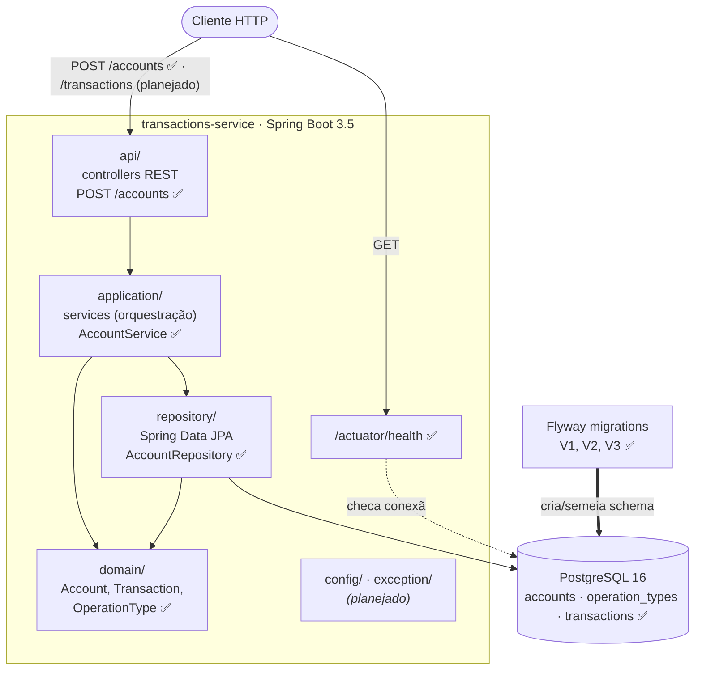

# transactions-service

Serviço de transações (contas e lançamentos financeiros), construído em fases.
Cada tipo de operação (compra à vista, compra parcelada, saque, voucher de
crédito) normaliza o sinal do valor: compras e saque são negativos, voucher é
positivo.

> **Estado atual:** walking skeleton + domínio/schema + primeiro endpoint de
> negócio (`POST /accounts`). Os demais endpoints, services e repositories
> chegam nas próximas fases. Veja o desenho abaixo.

---

## Arquitetura (visão macro)

O diagrama reflete o **alvo** da aplicação; os itens marcados com ✅ já existem,
os marcados com _(planejado)_ chegam em fases futuras. Será atualizado ao longo
do projeto.



**Camadas** (pacote raiz `io.github.danmke.transactions`):

| Pacote | Responsabilidade |
|---|---|
| `api/` | Controllers REST / DTOs — `AccountController`, `CreateAccountRequest`, `AccountResponse` ✅ (demais _planejado_) |
| `application/` | Services que orquestram o fluxo (buscam no repository, coordenam entidades, lançam exceptions de negócio) — `AccountService` ✅ (demais _planejado_) |
| `domain/` | Entidades e regra de negócio pura (sem depender de HTTP/controllers/DTOs) ✅ |
| `repository/` | Acesso a dados (Spring Data JPA) — `AccountRepository` ✅ (demais _planejado_) |
| `exception/` | Exceptions e tratamento de erro _(planejado)_ |
| `config/` | Configurações da aplicação _(planejado)_ |

---

## Requisitos para executar

O que a máquina precisa depende de **como** você quer rodar:

| Cenário | Requisitos |
|---|---|
| **Rodar a aplicação inteira** (`make up`) | Docker + Docker Compose + Make + Git |
| **Desenvolver / rodar testes** (`make test`, `make run`) | O acima **+ JDK 21** |

- **Docker Desktop precisa estar em execução** para os testes (Testcontainers) e para o `docker compose`.
- **Gradle não precisa ser instalado** — o *wrapper* (`gradlew` / `gradlew.bat`) baixa a versão correta automaticamente.
- No **Windows**, `make` não vem por padrão: instale com `choco install make` (Chocolatey) ou `scoop install make`.

---

## Versões utilizadas no desenvolvimento

| Ferramenta / Biblioteca | Versão |
|---|---|
| Java (JDK) | 21 LTS |
| Spring Boot | 3.5.16 |
| Gradle | 8.14.5 (via wrapper) |
| Plugin `io.spring.dependency-management` | 1.1.7 |
| PostgreSQL | 16.14 (imagem `postgres:16.14-alpine`) |
| Driver JDBC PostgreSQL | Gerenciado pelo Spring Boot 3.5.16 |
| Flyway | Gerenciado pelo Spring Boot 3.5.16 (`flyway-core` + `flyway-database-postgresql`) |
| Hibernate ORM | Gerenciado pelo Spring Boot 3.5.16 |
| JUnit Jupiter | Gerenciado pelo Spring Boot 3.5.16 |
| Testcontainers | Gerenciado pelo Spring Boot 3.5.16 |
| Docker Engine | 20.10+ (API mínima 1.40) |

---

## Como executar

Todos os comandos partem da raiz do projeto. A forma recomendada é via `make`
(rode `make help` para ver todos os alvos).

### Aplicação completa em Docker (não precisa de JDK)

```bash
make up          # build + sobe app e Postgres (foreground)
make up-d        # o mesmo, em segundo plano
make down        # derruba tudo
```

A app fica disponível em `http://localhost:8080`. Verifique a saúde:

```bash
curl http://localhost:8080/actuator/health   # -> {"status":"UP", ...}
```

### Desenvolvimento local (precisa de JDK 21)

```bash
make run         # sobe só o Postgres e roda a app com bootRun
make db-up       # sobe só o Postgres
make db-down     # para o Postgres
```

### Testes

```bash
make test        # suíte completa (unit + integração; precisa de Docker)
make test-unit   # só os testes unitários rápidos (sem Docker)
make retest      # re-roda tudo ignorando o cache "up-to-date" do Gradle
```

Relatório HTML dos testes: `build/reports/tests/test/index.html`.

### Sem `make` (Gradle/Compose direto)

```bash
./gradlew bootRun          # (Windows: .\gradlew.bat bootRun)
./gradlew test
docker compose up --build
```

---

## Estrutura do projeto

```
src/main/java/io/github/danmke/transactions/
  api/            # controllers REST            (planejado)
  application/    # services de orquestração    (planejado)
  domain/         # entidades + regra de negócio ✅
  repository/     # acesso a dados              (planejado)
  exception/      # tratamento de erros         (planejado)
  config/         # configurações              (planejado)
src/main/resources/
  application.yml
  db/migration/   # V1__create_accounts, V2__create_operation_types, V3__create_transactions
src/test/java/    # testes unitários e de integração
Dockerfile        # build multi-stage
docker-compose.yml
Makefile          # atalhos de build/execução/testes
```

---

## Design decisions

Registro incremental das decisões de projeto relevantes, organizado por fase.
Atualizado à medida que cada fase introduz uma decisão.

### Fase 1 — Walking skeleton

- **Gradle wrapper (sem Gradle global):** o `gradlew`/`gradlew.bat` fixa e baixa
  a versão exata do Gradle; ninguém precisa instalar Gradle na máquina.
- **Health check via Actuator primeiro:** prova de vida ponta a ponta (app sobe,
  conecta no banco, responde) antes de qualquer regra de negócio.
- **Docker multi-stage, build sem testes:** o estágio de build roda `bootJar`
  (não `build`), evitando exigir Docker-in-Docker; os testes de integração com
  Testcontainers rodam localmente / na pipeline, onde há um Docker acessível.
- **Testcontainers para integração:** os testes sobem um PostgreSQL **real**
  (mesma engine de produção) em vez de um banco em memória (H2), evitando
  divergências de comportamento.

### Fase 2 — Domínio e migrations

- **JPA introduzido só nesta fase:** a Fase 1 usava apenas o datasource; a
  dependência de JPA entra na fase que de fato a usa (não antecipar).
- **Chaves primárias `BIGINT` identity:** geradas pelo banco
  (`GENERATED ALWAYS AS IDENTITY`) — simples e sequenciais; a aplicação nunca
  define o id.
- **`OperationType` como enum de código + `AttributeConverter`:** não é entidade
  JPA e não tem repository; a tabela `operation_types` existe **só para a FK**.
  Um converter mapeia `enum ↔ operation_type_id`, preservando integridade
  referencial sem transformar o tipo num agregado consultável.
- **Dinheiro como `NUMERIC(19,2)` → `BigDecimal`; data como `TIMESTAMPTZ` →
  `OffsetDateTime`:** evita erros de ponto flutuante em valores monetários e
  ambiguidade de fuso horário.
- **Flyway como fonte única da verdade + `ddl-auto: validate`:** as migrations
  versionadas criam e semeiam o schema; o Hibernate apenas **valida** as
  entidades contra ele na subida, nunca altera o schema.
- **Invariantes garantidas nos construtores do domínio:** a normalização do
  sinal (`operationType.normalize(amount)`) e as validações defensivas
  (`amount` não nulo/zero; `document_number` não vazio, com `trim()`) acontecem
  **dentro** dos construtores de `Transaction` e `Account`. Assim é impossível
  instanciar uma entidade em estado inválido, independentemente de quem a cria.
  A validação "de negócio" que gera resposta HTTP fica para o service (Fase 5).
- **`CHECK` constraints no banco (`amount <> 0`,
  `btrim(document_number) <> ''`):** defesa em profundidade, além da validação
  no domínio.
- **`document_number` sem `UNIQUE`:** decisão explícita de não impor unicidade
  nesta fase.

### Fase 3 — POST /accounts

- **JSON em snake_case global** (`spring.jackson.property-naming-strategy:
  SNAKE_CASE`): o desafio especifica campos como `document_number` /
  `account_id`; configurar globalmente evita `@JsonProperty` espalhado pelos
  DTOs.
- **Validação no DTO espelha a coluna do banco** (`@Size(max = 50)` casa com
  `VARCHAR(50)`): sem isso, um documento acima do limite viraria erro **500** do
  banco em vez de **400** da aplicação. `@NotBlank` cobre ausência/branco.
- **DTOs dedicados em `api/dto/`** (`CreateAccountRequest`, `AccountResponse`),
  como `record`s: a entidade JPA nunca é serializada direto na resposta; o
  controller faz o mapeamento, mantendo `domain` livre de HTTP.
- **`AccountService` recebe primitivos, não DTOs:** os DTOs ficam confinados em
  `api/`; a camada `application` orquestra sobre o domínio.
- **`201 Created` + header `Location`** apontando para `/accounts/{id}` (o `GET`
  correspondente entra numa fase futura; aqui só emitimos o header).
- **Erros de validação usam o `400` padrão do Spring:** um handler de erro
  formatado é escopo de fase futura (`exception/`).
